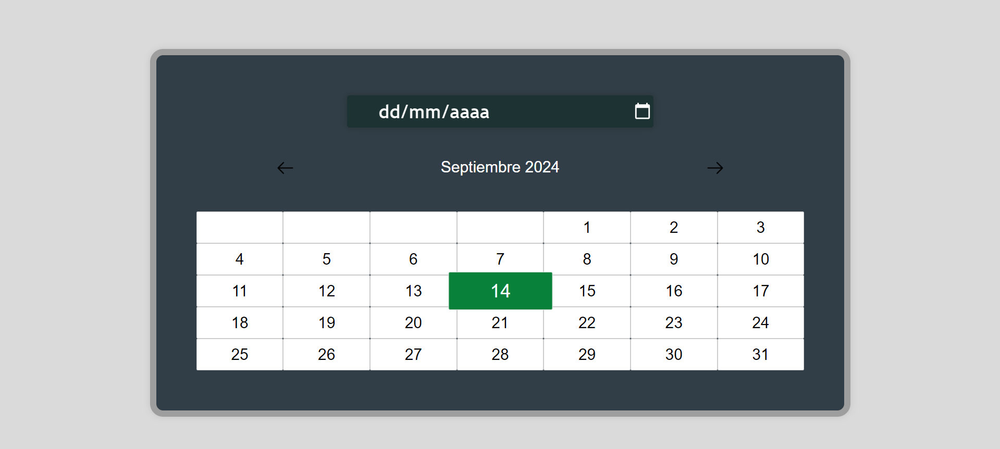

# Calendario nativo con HTML5 & CSS3 🌟

# Tecnologias usadas:  

  En este proyecto se muestra de manera visual, 
  un calendario web adaptable a dispositivos moviles, 
  aun no es funcional, pero para hare una nueva version de manera interactiva con el usuario
  esta es solo una prueba

